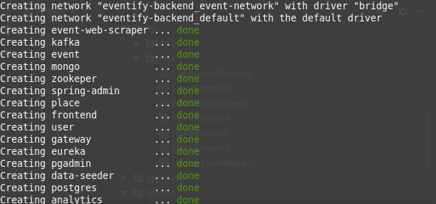

# Eventify project
Our project is helping you to find events that you are interested in. That's it!

# Motivation
Did it happened to you that you heard about the event where your friend went and you are sad because you haven't heard about that event on time so you missed it? You don't want to follow 17 facebook pages, university page, 3 websites and add follow some guys on LinkedIn so you can be informed about events you are interested in? You would like to find and filter all those events in one place? So do I, my friend, that is the reason why I have created this project.

# Application live
Unfortunately, out application is not live for now, but it will be soon.

# Contributing
If you are a developer and want to contribute to this project, feel free to contact me on [Linkedin](https://www.linkedin.com/in/spasoje-petronijevi%C4%87/).

If you are not a developer but you have some cool feature on your mind that can help my project, please share it with me.

# Getting started

You should have java 8, maven and docker installed before you start.

**Important**: Make sure that ports ```5432, 5050, 2181, 9092, 8761, 8762, 8200, 9990, 5060, 8080, 8222, 9100, 4500, 8182, 27017``` 
are not used since our services are running on that ports.
If you have some important processes running on those ports and you don't want to stop your processes,
feel free to change port numbers in my app for testing purposes on your local machine so you can start those services.
Just make sure that if you are changing port for example 9092 to 9093 change that number on all places in app!


```
git clone https://github.com/Calimerico/eventify.git
cd eventify-backend
chmod 755 start.sh
./start.sh
```
This command will take few minutes(it need to build your project, create docker images,register services to eureka, etc.)

When you end up with this screen:



app is not ready yet, you can receive 5xx error from server. Servers should register themself to eureka. It usually last ~30 seconds. Be patient. :)


That's it! You are now able to access application on ```http://localhost:8080/```

If you have any trouble with starting application, open an issue and I will resolve it.

# Tech/Frameworks/Architecture used

We implemented microservice architecture on backand and single page application on frontend.

This project is written mainly in Java for backend and React for frontend.


Keep in mind that since project is implemented with microservice architecture in mind, we can create services in techology by choice. 

Other notable technologies / frameworks / tools / libraries:
- Java 8
- React
- Spring framework
- Java Persistence API
- Apache Kafka
- Docker
- Mongo DB
- Postgres
- Lombok
- Jsoup

I plan to include more technologies soon, most notably **Kubernetes**.
